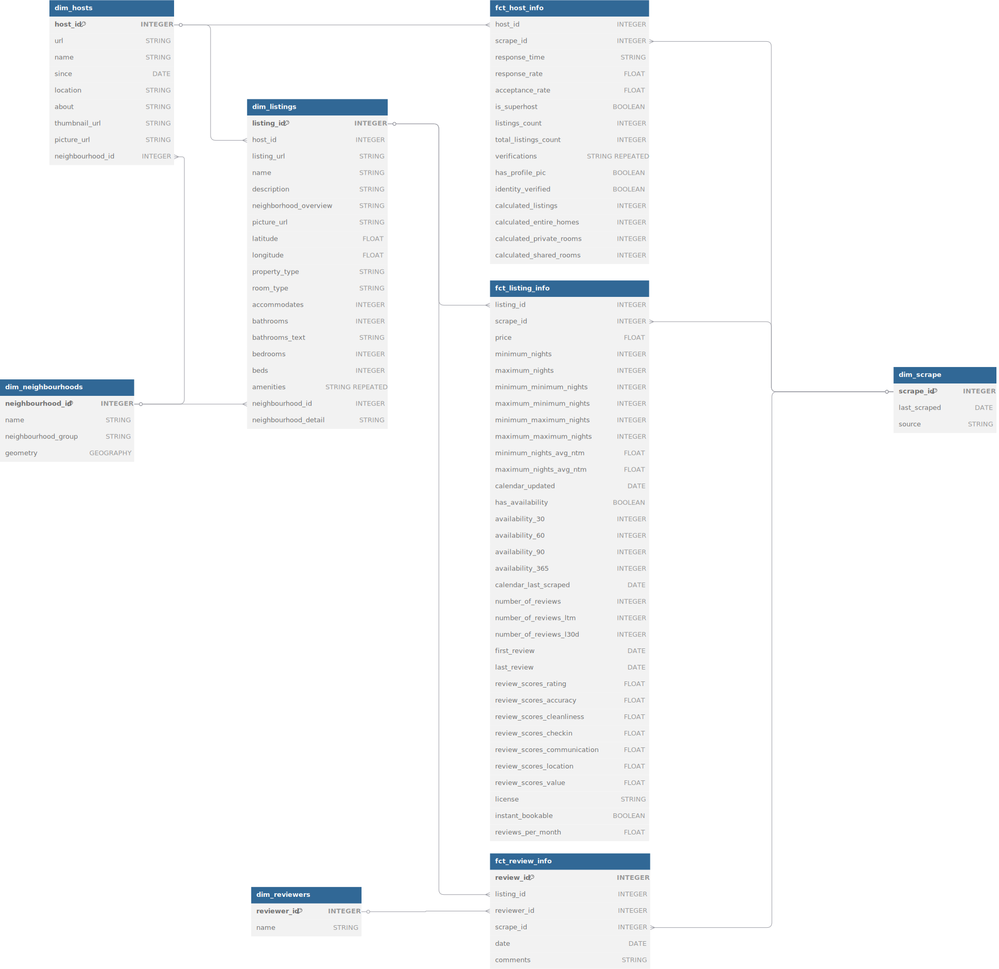

# Airbnb Data Engineering Project


## 💡 Introduction (Problem statement)

### 🌟 Key Features
* **On Premise** and **Cloud** ELT solutions
* **Custom dbt macros and generic tests** for Bigquery
* **Dimension modelling** for better understanding the dataset <details><summary>Click to view the entity–relationship diagram (powered by [dbdiagram.io](https://dbdiagram.io/d/67b4bda8263d6cf9a09b16e3))</summary><br>
    [](https://dbdiagram.io/d/67b4bda8263d6cf9a09b16e3)
    </details>

### Tech stacks and Architecture
* [Apache Airflow](https://airflow.apache.org/) for data orchestration 
* [Google Cloud Storage](https://cloud.google.com/storage/) for datalake
* [Google BigQuery](https://cloud.google.com/bigquery) for data warehouse
* [dbt](https://www.getdbt.com/) and [Astronomer Cosmos](https://astronomer.github.io/astronomer-cosmos/index.html) for data transformation and tests
* [Looker Studio](https://lookerstudio.google.com/overview) for data visualization
* [Terraform](https://www.terraform.io/) for cloud resource provision
* [Docker](https://www.docker.com/) for containerizing services
* [PostgresQL](https://www.postgresql.org/) (with [PostGIS](https://postgis.net/) extention enabled) for on-prem warehouse and airflow backend


### DashBoard


## 🚀 Get Started

Since everything is containerized in the project, the only prerequisite is to install [Docker](https://www.docker.com/). You can choose either of the below solutions to build and run a pipeline.

### On-premise ELT using Postgres
1. Git clone this repo.
2. Run docker compose under the repo directory: `docker compose up`
3. Access `localhost:8080` with your browser and login Airflow with `admin:admin`
4. Click the toggle of `postgres-elt` to activate the DAG

> under maintenance 

### Cloud ELT using Google Cloud Platform (GCP)
1. Git clone this repo.
2. Create a project `<your-project>` and a service-account and download the key file into the directory `credential/` and rename it to `application_default_credentials.json`
    * See [here]() for more details about setting up GCP project and credentials.
3. Run docker compose:
```shell
$> export TF_VAR_PROJECT=<your-project>
$> export TF_VAR_BUCKET_NAME=<your-bucket-name>
$> export TF_VAR_DATASET_ID=<your-dataset-id>
$> docker compose up 
```
4. Access `localhost:8080` with your browser and login Airflow with `admin:admin`
5. Click the toggle of `gcp-elt` to activate the dag

> [!NOTE]
> The bucket `<your-bucket-name>` and the dataset `<your-dataset-id>` will be created as the pipeline runs. You don't need to create them manually.

> [!WARNING]
> Even though the directory `credential` has been listed in `.gitignore` to prevent you from accidentally uploading your credential keys to github, don't push unless you make sure there is no settings leading to credential leakage!

#### Deployed successfully! 
If everything works as expected, you will get your Airflow orchestration results like this:


#### How to tear down resources / shut down the running container?
* If you are still running the docker container
    1. Run DAG `gcp-tear-down` and wait until it completes all the tasks
    2. Press `Ctrl+C` to stop the running container
    3. Run `docker compose down` under the repo directory to remove containers.
* If you have already `docker compose down`-ed the services
    * Run `terraform destroy` under the directory `terraform/` (we can still utilize lock files and other terraform config files to remove cloud resources if you have Terraform installed in your OS.)
    * Or delete them from google cloud console manually


## 🎛️ Customizing Guides

Here is some information for those who want to modify or extend this project for their own use.

### Workflow


### Configurations

We summarize how the components in the data pipeline are set up and where you can find these configurations in this repo.
<details>
<a href="https://www.mermaidchart.com/app/projects/74c2f0a3-fb2c-4d14-be7f-ea95dd482b40/diagrams/36c02c3f-83aa-4934-89f6-c0b6db355b07/version/v0.1/editg"></a>
</details>

#### Postgres
* The database account (username:password = `airflow:airflow`) and the default database `airflow` of **PostgreSQL** are set up in `docker-compose.yml`.
#### Airflow 
* **Airflow-related** environment variables are defined in `airflow/airflow.env`, which is passed to Docker Compose as an env-file.
* **Airflow's** login credentials (username:password = admin:admin) are set up in `entrypoint.sh`. The script `entrypoint.sh` spins up the airflow webserver and scheduler after the airflow user account created.
* The `airflow/Dockerfile` installs Terraform and Python dependencies listed in requirements.txt during the build stage.
#### Terraform
* **Terraform** receives cloud-related environment variables (prefixed with `TF_VAR_`) from Docker Compose (`-e` options) and applies them in `/terraform/main.tf` to provision cloud instances.
* Airflow dags obtain these environment variables by refering to `os.environ` in Python.
#### dbt
* **dbt** profiles are stored separately for cloud and on-premises setups under `dbt/gcp` and `dbt/postgres`, respectively.
* The cloud dbt profile reuses the Terraform environment variables (`TF_VAR_*`) to connect to Google Cloud Platform (GCP).
#### Google Cloud Platform
* By default, Google Cloud client looks for its key file at `~/.config/gcloud/application_default_credentials.json` (See [here](https://cloud.google.com/docs/authentication/application-default-credentials#personal)). To ensure access within the Docker container, we bind-mount the `/credentials` directory to `/root/.config/gcloud/`.
* For simplicity, both **Terraform** (`main.tf`) and **dbt** (`dbt/gcp/profiles.yml`) use the same key file (`application_default_credentials.json`) to interact with Google Cloud.
