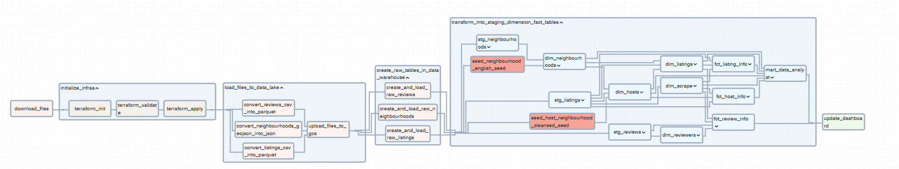

# Airbnb Data Engineering Project

> An ELT pipeline with Docker, GCP, Airflow, Terraform, GCP and dbt using Airbnb data

## 💡 Introduction
Suppose you are a data engineer at Airbnb. How would you design a data pipeline that meets the needs of data analysts, data scientists, and even LLM engineers?

We'll take on this challenge by using monthly data from [Inside Airbnb](https://insideairbnb.com/), an initiative that gathers Airbnb listings, reviews, calendar data, and neighborhood information from many countries. Our goal is to build a data pipeline from scratch. Given the large volume of data, we use the records from Taipei, Taiwan, covering the period between August 2022 and December 2024. We begin by extracting and loading this data into a data lake and a data warehouse, and we complete this ELT pipeline by constructing data marts, enabling data analysts and data scientists to query the necessary columns for exploration and insight generation.

**📝Read the [project docs](https://kevinkevin556.github.io/airbnb-de-project/) generated with [dbt](https://www.getdbt.com/) to know more about this data.**

### 🌟 Key Features
* **On Premise** and **Cloud** ELT solutions
* **Custom dbt macros and generic tests** for Bigquery
* **Multiple data marts** for different stakeholders
    * Data analyst - Summary information and metrics included in [listings.csv](https://insideairbnb.com/get-the-data/#:~:text=Taipei%2C%20Northern%20Taiwan%2C%20Taiwan) for listings in Taipei (good for visualisations) 
    * Data scientist - Features generated based on [From Data to Insights: Segmenting Airbnb’s Supply](https://medium.com/airbnb-engineering/from-data-to-insights-segmenting-airbnbs-supply-c88aa2bb9399) from [The Airbnb Tech Blog](https://medium.com/airbnb-engineering) for supply pattern segmentation
* **Dimension modelling** for better understanding the dataset <details><summary>Click to view the entity–relationship diagram (powered by [dbdiagram.io](https://dbdiagram.io/d/67b4bda8263d6cf9a09b16e3))</summary><br> [](https://dbdiagram.io/d/67b4bda8263d6cf9a09b16e3)</details>

### Tech stacks and Architecture
* [Apache Airflow](https://airflow.apache.org/) for data orchestration 
* [Google Cloud Storage](https://cloud.google.com/storage/) for datalake
* [Google BigQuery](https://cloud.google.com/bigquery) for data warehouse
* [dbt](https://www.getdbt.com/) for data transformation, tests and docs
* [Astronomer Cosmos](https://astronomer.github.io/astronomer-cosmos/index.html) for better integration between [Apache Airflow](https://airflow.apache.org/) and [dbt](https://www.getdbt.com/)
* [Looker Studio](https://lookerstudio.google.com/overview) for data visualization
* [Terraform](https://www.terraform.io/) for cloud resource provision
* [Docker](https://www.docker.com/) for containerizing services
* [PostgresQL](https://www.postgresql.org/) (with [PostGIS](https://postgis.net/) extention enabled) for on-prem warehouse and airflow backend


### Dashboard


Final result from Google Looker Studio. [Link](https://lookerstudio.google.com/u/0/reporting/606c5c3d-9afd-4e9f-8e9d-43902ae46d23/page/p_hsqb6vwzpd) here. 

## 🚀 Get Started

Since everything is containerized in the project, the only prerequisite is to install [Docker](https://www.docker.com/). You can choose either of the below solutions to build and run a pipeline.

> [!NOTE]
> Due to the eol (end-of-line) issue, you may want to set `git config --global core.autocrlf input` before you clone the repo if you are using WSL, Linux, or MacOS.

### On-premise ELT using Postgres
1. Git clone this repo.
2. Run docker compose under the repo directory: `docker compose up`
3. Access `localhost:8080` with your browser and login Airflow with `admin:admin`
4. Click the toggle of `postgres-elt` to activate the DAG

> under maintenance 

### Cloud ELT using Google Cloud Platform (GCP)
1. Git clone this repo.
2. Create a project `<your-project>` and a service account. Grant your service account the following two roles: `BigQuery Admin` and `Storage Admin`.
3. Download the service account key file into the directory `credentials/` and rename it to `application_default_credentials.json`
    * See [here](gcp-setup.md) for more details about setting up GCP project and credentials.
4. In your shell, set the following environment variables and run docker compose:
```shell
$> export TF_VAR_PROJECT=<your-project>         # e.g. de-project-demo
$> export TF_VAR_BUCKET_NAME=<your-bucket-name> # e.g. de-project-bucket-72116
$> export TF_VAR_DATASET_ID=<your-dataset-id>   # e.g. de_project_dataset_72116
$> docker compose up 
```
5. After Airflow is ready (see note), access `localhost:8080` with your browser for the Airflow webUI and login with `admin:admin`
6. Click the toggle of `gcp-elt` to activate the dag

> [!NOTE]
> **GCP Settings** <br>
> The bucket `<your-bucket-name>` and the dataset `<your-dataset-id>` will be created as the pipeline runs. You don't need to create them manually. However, 
> 1. The bucket name should be globally unique, so we add a random number after the bucket name.
> 2. The dataset id does not allow hyphens, so we have to use underscores instead.

> [!WARNING]
> Even though the credentials directory is listed in .gitignore to prevent accidental uploads of credential keys, do not push the cloned repo unless you are certain there are no settings that could lead to credential leakage!

> [!Note]
> **When is your Airflow ready?**<br>
> You can open the webUI of Airflow once you see something quite similar to the following messages:
```
webserver-1  | [2025-04-02 08:54:28 +0000] [87] [INFO] Listening at: http://0.0.0.0:8080 (87)
webserver-1  | [2025-04-02 08:54:28 +0000] [87] [INFO] Using worker: sync
webserver-1  | [2025-04-02 08:54:28 +0000] [347] [INFO] Booting worker with pid: 347
webserver-1  | [2025-04-02 08:54:29 +0000] [348] [INFO] Booting worker with pid: 348
webserver-1  | [2025-04-02 08:54:30 +0000] [349] [INFO] Booting worker with pid: 349
webserver-1  | [2025-04-02 08:54:32 +0000] [350] [INFO] Booting worker with pid: 350
```

### Deployed successfully! 
If everything works as expected, you will get your Airflow orchestration results like this:


### How to tear down resources / shut down the running container?
* If you are still running the docker container
    1. Run DAG `gcp-tear-down` and wait until it completes all the tasks
    2. Press `Ctrl+C` to stop the running container
    3. Run `docker compose down` under the repo directory to remove containers.
* If you have already `docker compose down`-ed the services
    * Run `terraform destroy` under the directory `terraform/` (we can still utilize lock files and other terraform config files to remove cloud resources if you have Terraform installed in your OS.)
    * Or delete them from google cloud console manually


## 🎛️ Customizing Guides

Here is some information for those who want to modify or extend this project for their own use.

### Workflow


### Test Periods
The variable `test_periods` controls how many months this data pipeline processes. The default value is set to 1 to facilitate testing or replication.

```python
test_periods = 1

with DAG(
    "gcp-elt",
    # ...
    schedule=get_schedule(-test_periods),
    # ...
):
    # ...
```
If you would like to obtain data for more than a month, for instance, you can set `test_periods = 13` (to create meaningful  yearly features for DS data marts) to store listings data of last 13 months in the data warehouse.

To get the full dataset which I visualized in my dashboard, you modify the `get_schedule()` argument like:

```python
with DAG(
    "gcp-elt",
    # ...
    schedule=get_schedule(start=0), # or simply: get_schedule()
    # ...
):
    # ...
```

### Configurations

We summarize how the components in the data pipeline are set up and where you can find these configurations in this repo.
<details>
<a href="https://www.mermaidchart.com/app/projects/74c2f0a3-fb2c-4d14-be7f-ea95dd482b40/diagrams/36c02c3f-83aa-4934-89f6-c0b6db355b07/version/v0.1/editg"></a>
</details>

#### Postgres
* The database account (username:password = `airflow:airflow`) and the default database `airflow` of **PostgreSQL** are set up in `docker-compose.yml`.
#### Airflow 
* **Airflow-related** environment variables are defined in `airflow/airflow.env`, which is passed to Docker Compose as an env-file.
* **Airflow's** login credentials (username:password = admin:admin) are set up in `entrypoint.sh`. The script `entrypoint.sh` spins up the airflow webserver and scheduler after the airflow user account created.
* The `airflow/Dockerfile` installs Terraform and Python dependencies listed in requirements.txt during the build stage.
#### Terraform
* **Terraform** receives cloud-related environment variables (prefixed with `TF_VAR_`) from Docker Compose (`-e` options) and applies them in `/terraform/main.tf` to provision cloud instances.
* Airflow dags obtain these environment variables by refering to `os.environ` in Python.
#### dbt
* **dbt** profiles are stored separately for cloud and on-premises setups under `dbt/gcp` and `dbt/postgres`, respectively.
* The cloud dbt profile reuses the Terraform environment variables (`TF_VAR_*`) to connect to Google Cloud Platform (GCP).
#### Google Cloud Platform
* By default, Google Cloud client looks for its key file at `~/.config/gcloud/application_default_credentials.json` (See [here](https://cloud.google.com/docs/authentication/application-default-credentials#personal)). To ensure access within the Docker container, we bind-mount the `/credentials` directory to `/root/.config/gcloud/`.
* For simplicity, both **Terraform** (`main.tf`) and **dbt** (`dbt/gcp/profiles.yml`) use the same key file (`application_default_credentials.json`) to interact with Google Cloud.

## 📚 Useful Links & Learning Resources

* [Data Engineering Zoomcamp ](https://github.com/DataTalksClub/data-engineering-zoomcamp)

### Best practices
* [Best Practices for Airflow](https://airflow.apache.org/docs/apache-airflow/stable/best-practices.html)
* [Best practice guides from dbt](https://docs.getdbt.com/best-practices)

### Projects
* [Interactive DataTalksClub Course Projects Dashboard](https://datatalksclub-projects.streamlit.app/)
* [practical-data-engineering](https://github.com/ssp-data/practical-data-engineering)
* [DataEngineeringProject](https://github.com/damklis/DataEngineeringProject)


 