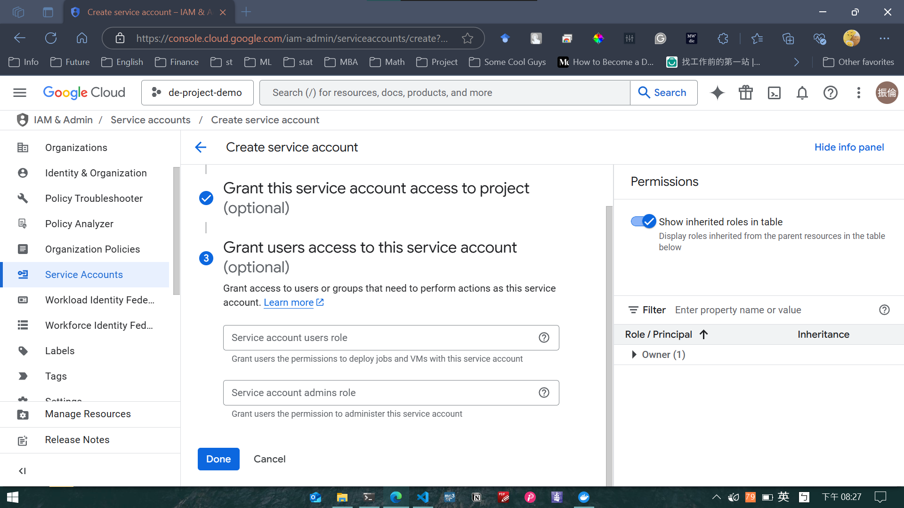

## Create a new project
1. Visit your google console, click the  `projects` button next to the search bar to open `Select a project` pop-up, and click `NEW PROJECT`.

2. Fill in `Project name` with a project name you like (here I name my project `de-project-demo`), and click `Create`.

>  [!WARNING]
> The project id can be differ from your project name if you have already used the name for your old project. For instance, in this screenshot, the project name of my new project is "de-project-demo" but its project id is "de-project-demo-455512".

>  [!NOTE]
> I'll use my "de-project-demo" project with `project id = de-project-demo` for the following demostration.

## Create a service account

1. Visit the page `IAM & Admin > Service Account`, and click `Create service account`

2. Fill in `Service account name` with your favorite service account name (here I name it `de-project-admin`), and click `Create and continue`.

3. Click `+ Add another role` and type `Bigquery Admin` in the search bar to grant Bigquery admin to this service account. Repeat the actions again to add `Storage Admin`. Click `Continue`.

4. No additional settings for user access. Just click `Done` to finish creating a service account.

## Create & Download service account key

1. After the service account is created, click `Actions` and then `Manage keys`.

2. Click `add key` and then `Create new key`.

3. The key is successfully created. Now we are going to save this json file to your computer. (Continue)

4. Save the key json file to `<repo-dir>/credentials` and name it `application_default_credentials.json`.

5. Everything is done. You can see the key you just generated on the `Keys` page. You are now ready for the next step to build this data pipeline!

